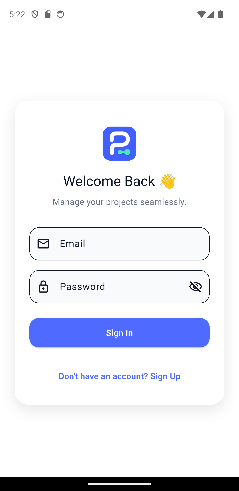
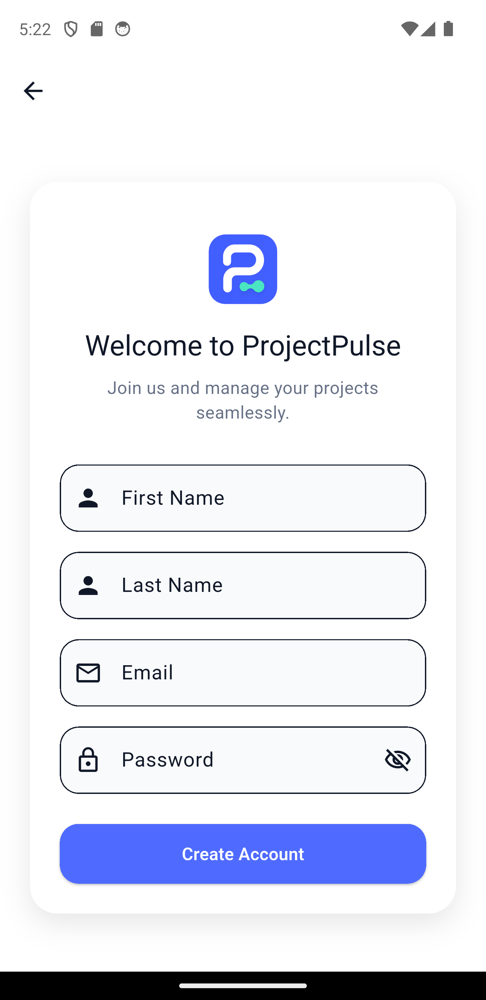
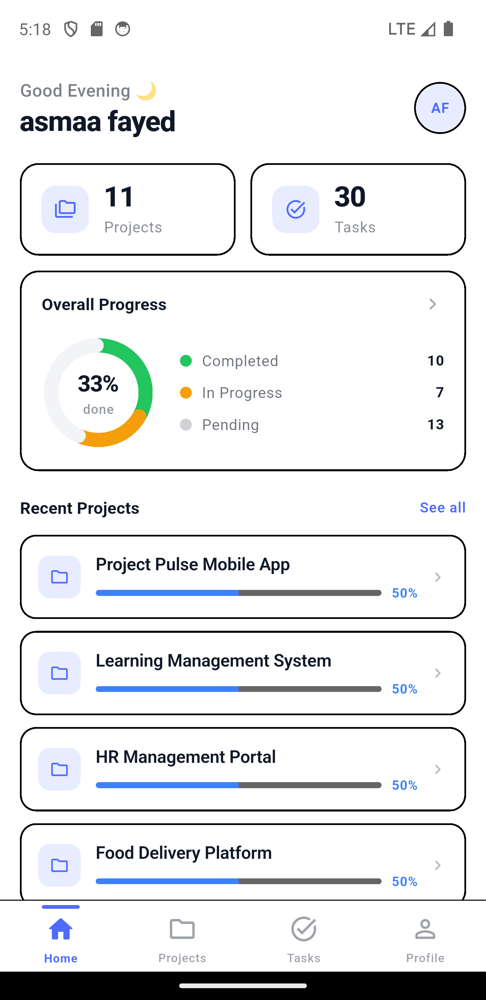
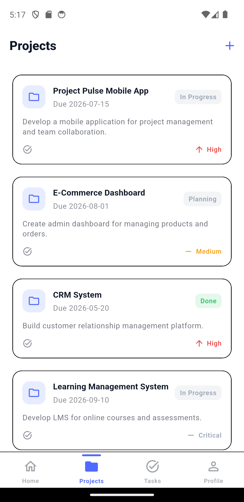
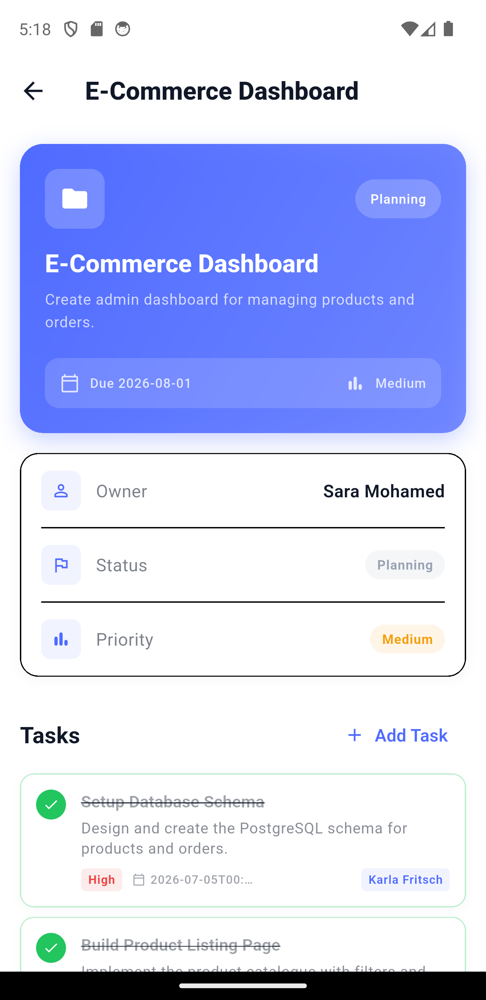
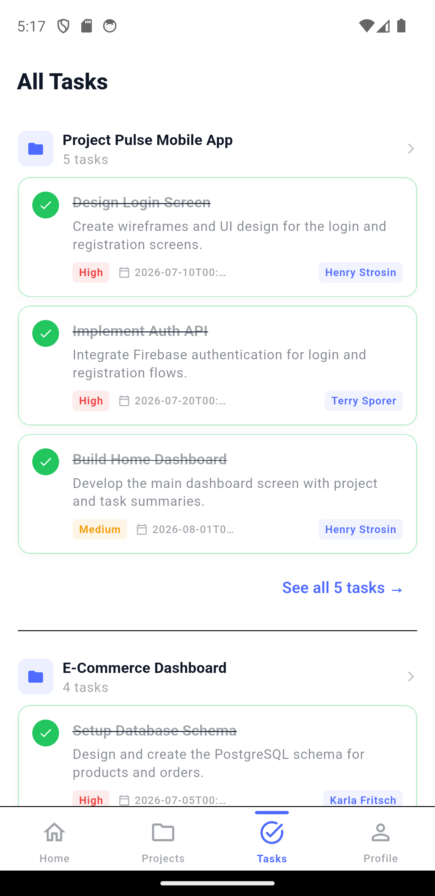
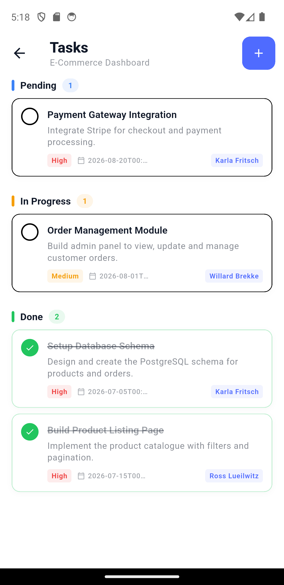
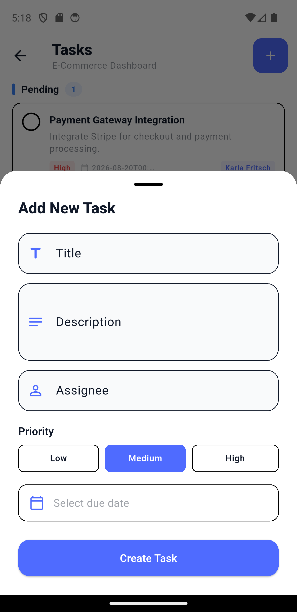
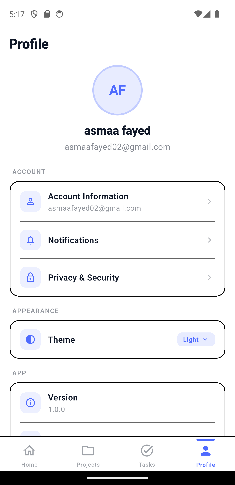
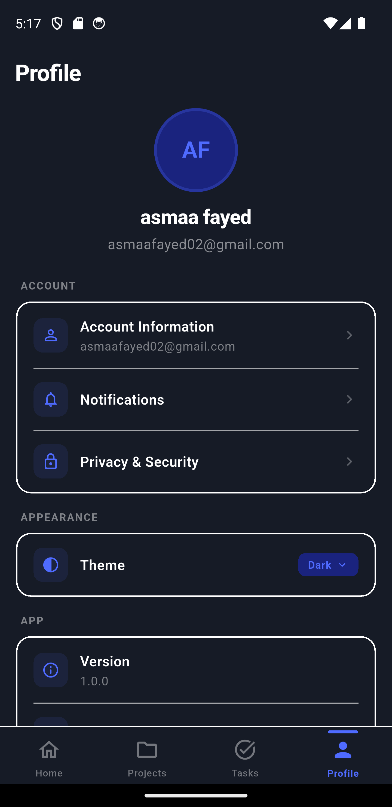

# Project Pulse

A modern Flutter application for project and task management, built using Clean Architecture and Riverpod. The application enables users to manage projects, organize tasks, track progress, and monitor productivity through a clean and responsive user interface.

---

## Features

- Authentication (Login & Register)
- Dashboard with projects overview
- Project management
- Task management
- Task status tracking
- Pull-to-refresh support
- Loading skeletons (Shimmer)
- Friendly error handling
- Responsive UI
- Dark Theme support

---

## Architecture

This project follows **Clean Architecture**.

```
lib/
├── app/
├── core/
├── features/
│   ├── auth/
│   ├── home/
│   ├── profile/
│   ├── projects/
│   ├── splash/
│   └── tasks/
```

Each feature is divided into:

- data
- domain
- presentation

State management is implemented using **Riverpod**.

---

## Backend & Services

### Authentication

User authentication is implemented using **Firebase Authentication**.

Supported features:

- Email & Password Login
- User Registration
- Persistent Authentication Session

### Project & Task Data

Projects and tasks are managed using **MockAPI**.

Base URL:

```text
https://6a3bf19be4a07f202e163780.mockapi.io/api/v1
```

Resources:

- `/projects`
- `/tasks`

Networking is implemented using **Dio**.

---

## Tech Stack

- Flutter
- Dart
- Riverpod
- Dio
- GoRouter
- Firebase Authentication
- MockAPI
- Fpdart
- Shimmer
- Intl

---

## Screenshots

### Authentication

<p align="center">
  
  
</p>

### Dashboard

<p align="center">
  
</p>

### Projects

<p align="center">
  
  
</p>

### Tasks

<p align="center">
  
  
  
</p>

### Profile

<p align="center">
  
  
</p>

---

## Getting Started

### Clone the repository

```bash
git clone <repository-url>
cd project_pulse
```

### Install dependencies

```bash
flutter pub get
```

### Run the application

```bash
flutter run
```

---

## Build Release APK

```bash
flutter build apk --release
```

The generated APK will be located at:

```text
build/app/outputs/flutter-apk/app-release.apk
```

---

## Dependencies

Major packages used in this project:

```yaml
flutter_riverpod
dio
go_router
firebase_auth
firebase_core
fpdart
intl
flutter_svg
shimmer
equatable
shared_preferences
```

---

## APK

You can download the latest APK from:

- GitHub Releases (https://github.com/asmaafayed02project_pulse/releases/latest)


---

## Future Improvements

- Offline support
- Search & Filtering
- Push Notifications
- Unit Testing
- Widget Testing
- Integration Testing
- CI/CD Pipeline with GitHub Actions

---

## Author

**Asmaa**

Flutter Developer